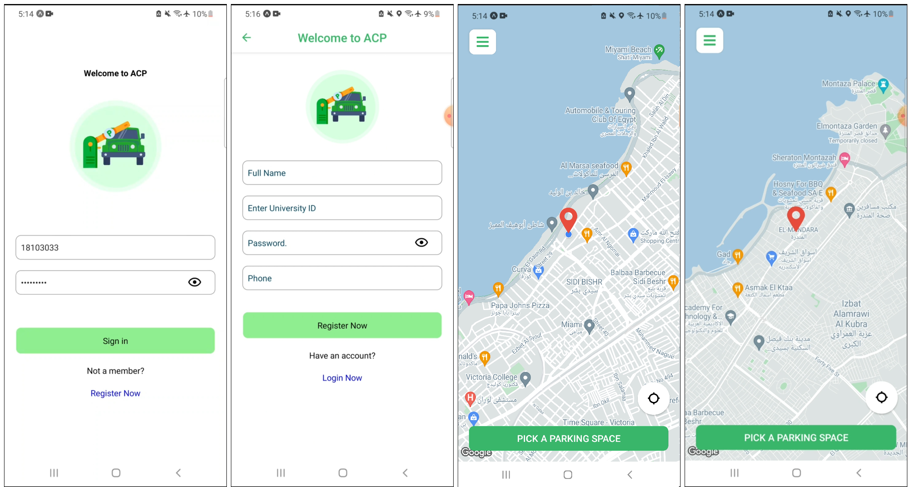
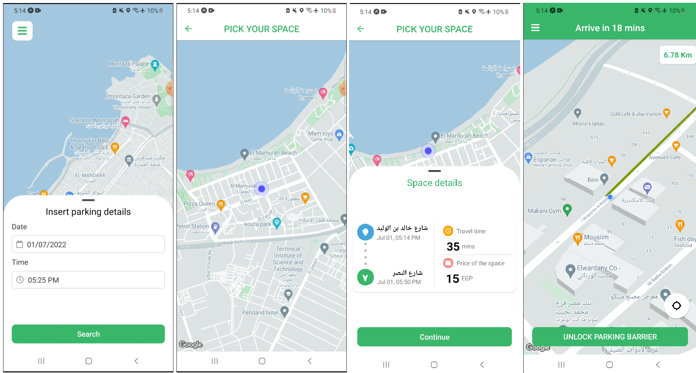

# ACP_Frontend_RN

A user-friendly car parking application is produced and built using React Native technology and fully connected to the backend that is responsible for the processing data and communicating with IoT devices in addition to the databases.

User can register/login, picks the destination and then the application will response with the available parking spaces within 5K.M., user chooses one parking space and the app starts navigating the user to the destination, after that user requests to open the parking barrier and after they finish, they pay the parking fees using Stripe API.  

Requests are sent to the Mapbox API to get accurate directions as well as calculating the travel time to the destination.

## App Interfaces

 

